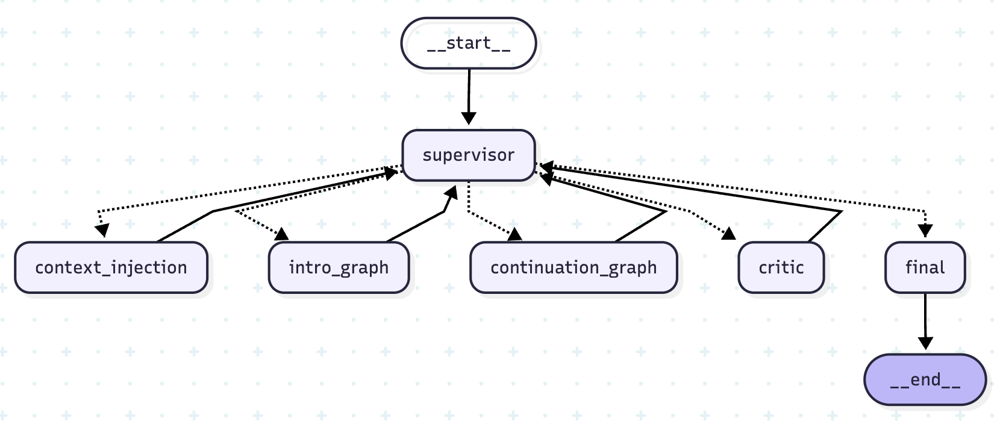
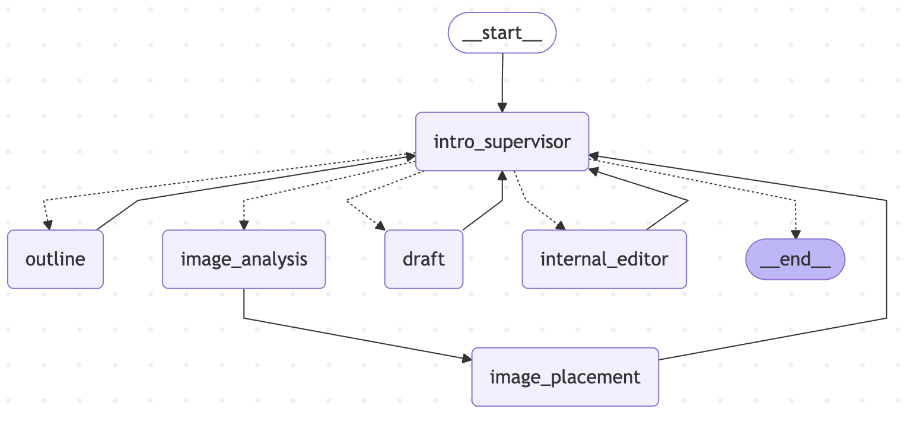
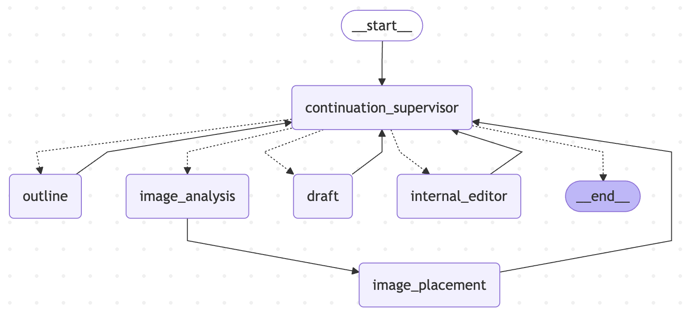

# Insight-Driven Blog Agent



**Insight-Driven Blog Agent**는 사용자의 짧은 인사이트와 캡처 이미지를 바탕으로, 마치 전문가가 쓴 듯한 고품질의 블로그 포스팅을 자동 생성해 주는 **LangGraph 기반 멀티 에이전트 시스템**입니다. 

단순한 텍스트 생성을 넘어, **과거 연재글의 맥락을 기억**하고 **나만의 말투를 모방**하며, 깐깐한 AI 편집장의 **피드백 루프**를 통해 스스로 글을 수정하는 진정한 의미의 자율형 AI 작가입니다.

---
## 서브 그래프 상세 구조 (Sub-Graph Architecture)

본 시스템은 메인 Supervisor 하에 특수 목적을 수행하는 두 가지 서브 그래프를 독립적으로 운용하여 작업의 정밀도를 높였습니다.

### 1. Intro Post Graph (첫 포스팅 전용)
새로운 토픽의 시작을 알리는 1편 작성을 담당합니다. 아웃라인 기획부터 초안 작성, 윤문, 그리고 비전 에이전트를 통한 이미지 배치까지의 전 과정을 자동화합니다.
- **주요 노드:** `intro_outline` -> `intro_draft` -> `internal_editor` -> `common_image_agent`


### 2. Continuation Post Graph (연재물 전용)
이전 글들의 맥락(`accumulated_context`)을 유지하며 시리즈의 다음 편을 작성합니다. 기존 서사를 파괴하지 않으면서 새로운 인사이트를 자연스럽게 결합하는 데 최적화되어 있습니다.
- **주요 노드:** `continuation_outline` -> `continuation_draft` -> `internal_editor` -> `common_image_agent`


---

## 핵심 기능

### 1. 멀티 에이전트 오케스트레이션 (LangGraph)
단일 모델에 의존하지 않고, 역할이 세분화된 여러 에이전트가 협업합니다.
- **Supervisor Agent:** 전체 워크플로우를 통제하고 라우팅합니다.
- **Planner / Outline Agent:** 글의 뼈대를 기획합니다.
- **Writer / Editor Agent:** 초안을 작성하고 문맥을 매끄럽게 윤문합니다.
- **Vision Agent:** 첨부된 다이어그램 및 스크린샷을 분석하여 마크다운 내 최적의 위치에 삽입합니다.

### 2. 장기 기억 기반 연재글 작성 (VectorDB-RAG)
ChromaDB를 연동하여 **토픽 방(Topic Room)** 개념을 구현했습니다.
- **맥락 유지:** 이전 시리즈에서 다룬 내용을 VectorDB에서 불러와, 중복된 개념 설명을 피하고 자연스럽게 서사를 이어갑니다.
- **메타데이터 저장:** 방별로 지정된 톤앤매너를 DB에 영구 고정하여 일관된 시리즈물을 작성할 수 있습니다.

### 3. 사용자 정의 톤앤매너 추출기
평소 본인이 작성하던 블로그 글을 입력하면, 빠르고 저렴한 모델(`gpt-5.4-mini`)이 문체를 분석하여 **프롬프트 형태의 행동 지침(Tone & Manner)**으로 추출하고 에이전트에 주입합니다.

### 4. 리플렉션 및 자가 수정 (Reflection & Self-Correction)
- **Critic Agent:** 엄격한 편집장 역할을 수행하여, 글이 톤앤매너를 지켰는지, 논리적 비약은 없는지 평가합니다.
- **Feedback Loop:** 통과하지 못할 경우(REVISE), 피드백 내용을 Writer 에이전트에게 전달하여 초안부터 다시 작성(Clean State)하게 만드는 강력한 품질 보증 로직을 탑재했습니다.

### 5. 직관적인 Web UI (Streamlit)
SPA(Single Page Application) 수준의 매끄러운 사용자 경험을 제공합니다.
- 실시간 에이전트 작업 상태 모니터링
- 방 생성 및 삭제(DB 동기화), 동적 UI 전환
- 탭 분리를 통한 최종 마크다운 소스코드 원클릭 복사

---

## 기술 스택 (Tech Stack)

- **Framework:** LangChain, LangGraph
- **Frontend:** Streamlit
- **Database:** ChromaDB (Vector Store)
- **LLM:** OpenAI (`gpt-5.4-mini`, `gpt-5.5`)
- **Embeddings**: OpenAI (`text-embedding-3-small`)
- **Language:** Python 3.10+

---

## 프로젝트 구조 (Project Structure)

```text
blog_agent_project/
├── app.py                           # Streamlit 웹 UI 및 메인 실행 파일
├── blog_agent_workflow.png          # 에이전트 워크플로우 다이어그램
├── requirements.txt                 # 패키지 의존성
├── docs/                            # 프로젝트 설계 가이드 및 마일스톤 문서
│   ├── 01_project_milestone.md
│   ├── 02_branch_guide.md
│   ├── 03_commit_message_guide.md
│   └── 04_prompt_guide.md
└── src/
    ├── graph.py                     # LangGraph StateGraph 및 워크플로우 정의
    ├── state.py                     # 공유 상태(State) 스키마 정의 (TypedDict)
    ├── memory.py                    # ChromaDB 초기화 및 컨텍스트 관리 로직
    ├── utils.py                     # 유틸리티 (톤앤매너 분석기 등)
    └── nodes/                       # 에이전트 노드 구현부
        ├── main_node.py             # Supervisor, Critic, Final Agent
        └── sub_graph_nodes/         # 서브 그래프 전용 노드
            ├── intro_graph_node.py        # 1편 전용 파이프라인
            ├── continuation_graph_node.py # 연재글 전용 파이프라인
            └── common_node.py             # 공통 기능 (이미지 비전 분석 및 배치)